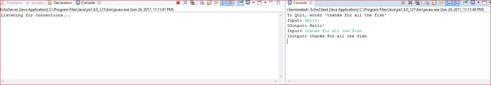

# Java Server Client Implementation

This is a multi-threaded Java implementation of a client/server program.

The server listens for client connections and if one is recieved it sends it to a client handler where the client can send text to the server and it will simply echo it back to the client. The client can exit by typing "thanks for all the fish" and the server will continue to run.

